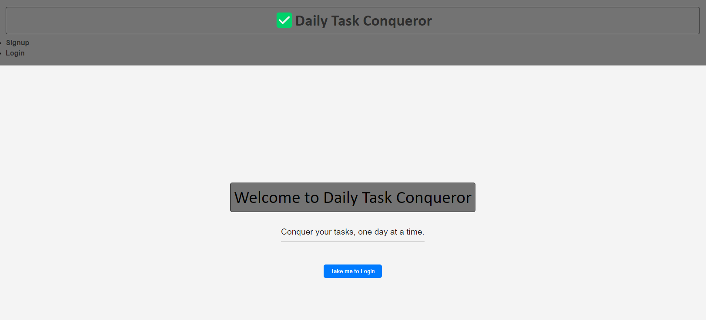
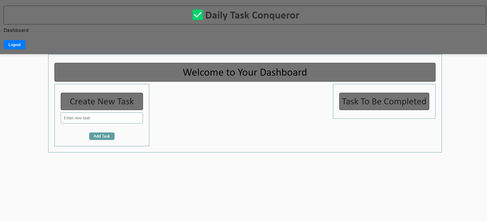

# DailyTaskConqueror

## Table of Contents
- [DailyTaskConqueror](#dailytaskconqueror)
  - [Table of Contents](#table-of-contents)
  - [Description](#description)
  - [Installation](#installation)
  - [Usage](#usage)
  - [Contributing](#contributing)
  - [License](#license)
  - [Questions](#questions)

## Description
This progressive web application uses MongoDB for the database, Webpack to bundle the front-end, Workbox for the service worker used to cache static assets, and Heroku for the deployment host. Users can install this application to use offline or access it online [HERE](https://NEWDEPLOYLINK.herokuapp.com/).

## Installation
Pull down the repo from https://github.com/Gr1ssom/DailyTaskConqueror/

## Usage
1. Go to the root directory of the project, DailyTaskConqueror.
2. Enter `npm install`
3. To start the servers, run `npm run start:dev`
4. Go to the browser that opens and use the app.

## Contributing
Fork the repository, make your changes, and submit a pull request.

## License
Checkout [MIT License](https://mit-license.org/) for this project's license information.

## Questions
Visit our repo at https://github.com/Gr1ssom/DailyTaskConqueror and contact the contributors.
